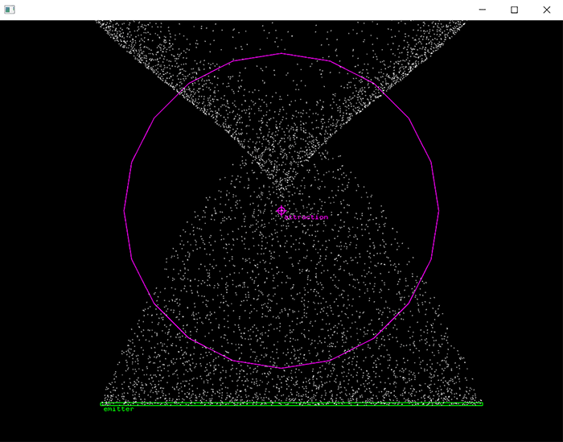

# Particle system

### Learning Objectives

In this part of the workshop we'll create a flexible particle system featuring emitters and forces, during this process you will learn how to:

* Move particles using vectors.
* Structure our code using OOP (object-oriented programming).
* Efficiently store particle data in memory.
* Render particles using VBOs (vertex buffer objects).
* Move particles based on forces.
* Interact and experiemnt with parameters through a GUI. 

A particle system is also a great example of how we can create complexity from simple sets of rules.

### Addons used in the app

* ofxGui (core addon)

### Useful resources

* [C++ basics](https://openframeworks.cc/ofBook/chapters/cplusplus_basics.html) - Basics of c++.
* [Object-oriented programming in oF](https://openframeworks.cc/ofBook/chapters/OOPs!.html) - Good intro to OOP in c++ with openFrameworks.
* [Memory in c++](https://openframeworks.cc/ofBook/chapters/memory.html) - Pointers, references, memory structures, arrays and vectors. A good place to start understanding the powerfull c++ memory management features.
* [VBOs in oF]() - Documentation about VBOs in openFramewokrs.
* [The nature of code - Forces](https://natureofcode.com/book/chapter-2-forces/#29-gravitational-attraction) - Daniel Shiffman's book is one of the best resources to begin learning about vectors, forces and simulating natural phenomena  with code.

Some of the links above are from the [ofBook](https://openframeworks.cc/ofBook/chapters/foreword.html), a collaborative book from the community. If you are new to oF I recommend that you read all of it. 