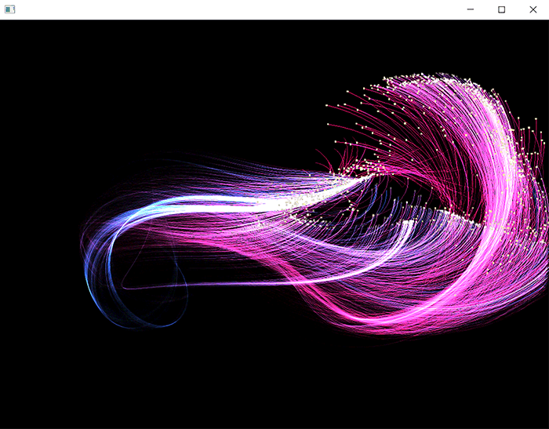

# Particle system - rendering with shaders

### Learning Objectives

In this part of the workshop we'll explore different ways of rendering our particle data using shaders. ...

* Render particles using VBOs (vertex buffer objects).
* Add custom attributes to our VBO
* Use vertex and fragment shaders to create different look from the same particle data.
* Create trails using FBOs
* Explore a the possibilities of our particle system by playing with its parameters

### Addons used in the app

* ofxGui (core addon)

### Useful resources

* [Intro to OpenGL in oF](https://openframeworks.cc/ofBook/chapters/openGL.html)
* [Shaders in oF](https://openframeworks.cc/ofBook/chapters/shaders.html)
* [VBOs in oF]() - Documentation about VBOs in openFramewokrs.