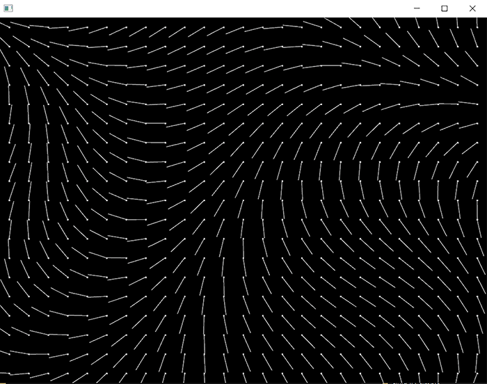

# Forcefields

### Learning Objectives

* The concepts of grid, size and resolution and their relation to visual output and performance.
* Store our data (force vectors) as pixels.
* Visualize the values of the grid.

### Addons used in the app

* ofxGui (core addon)
