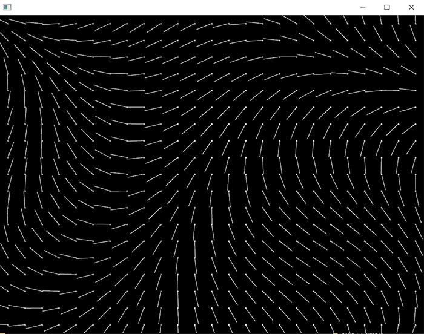

# Forcefields

### Learning Objectives

* The concepts of grid, cell, grid size and resolution and their relation to visual quality and performance.
* Store our data (force vectors) as pixels.
* Use noise to generate values for the grid. 
* Visualize the values of the grid.
* Play with parameters.

### Addons used in the app

* ofxGui (core addon)
