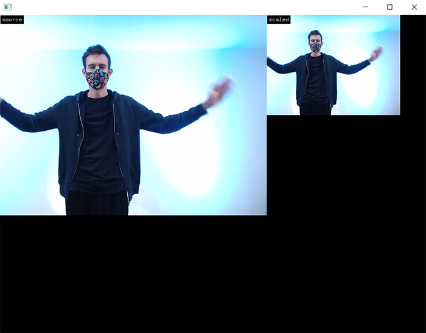

# Video sources



### Learning Objectives

* Extract pixels from a webcam using ```ofVideoGrabber```.
* Extract pixels from a movie using ```ofVideoPlayer```.
* Create a VideoSource class to easily swap video sources.
* Downscale the pixels.

### Addons used in the app

* ofxGui (core addon)

### Useful resources

* Check the examples in ```examples/video/``` inside your openFrameworks folder.