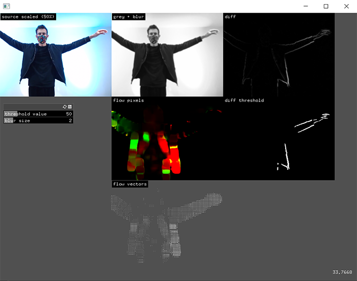

# Computer vision in openFrameworks

The term "computer vision" refers to algorithms that help us extract information from static and moving images. 

### Learning Objectives

* Get more familiar with oF image types (ofPixels, ofTexture and ofImage).
* Perform low level image processing operations on videos (such as differencing, thresholding and blurring) using ofxCv.
* Extract the optical flow from a video feed.

### Addons used in the app

* ofxGui (core addon)
* [ofxCv](https://github.com/kylemcdonald/ofxCv)

### Useful resources

* Check the documentation for in [ofPixels](https://openframeworks.cc/documentation/graphics/ofPixels/), [ofTexture](https://openframeworks.cc/documentation/gl/ofTexture/) and [ofImage](https://openframeworks.cc/documentation/graphics/ofImage/)/
* Check the readme and the examples inside the [ofxCv](https://github.com/kylemcdonald/ofxCv) addon.