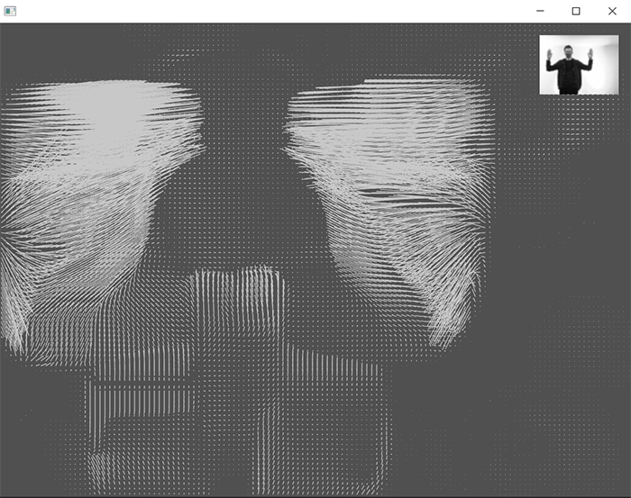

# Optical flow field

 

### Learning Objectives

* We will extend our ```Forcefield``` class with functionality to compute optical flow. 

### Addons used in the app

* ofxGui (core addon)
* [ofxCv](https://github.com/kylemcdonald/ofxCv)
