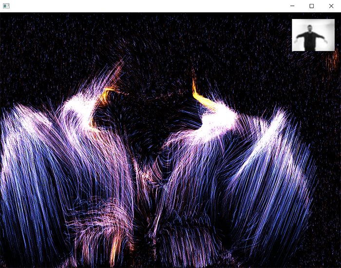

# Particles optical flow

 

### Learning Objectives

* Use our optical flow force field to move the particles.
* Play with parameters.

### Addons used in the app

* ofxGui (core addon)
* [ofxCv](https://github.com/kylemcdonald/ofxCv)
